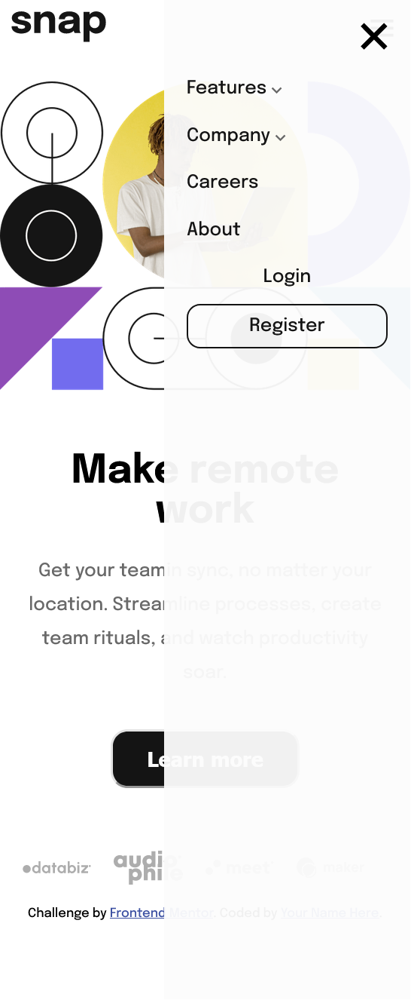
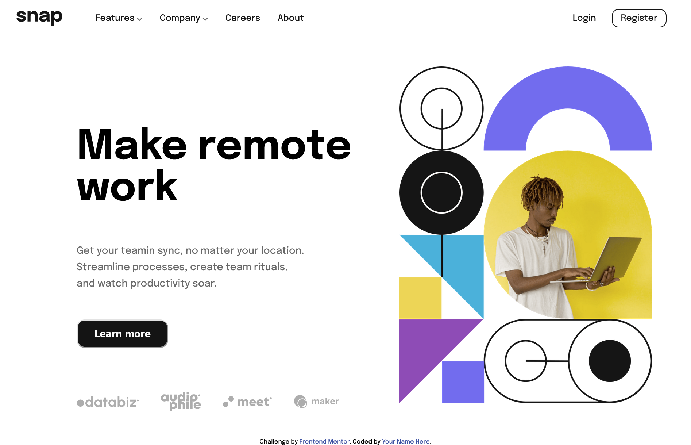

# Frontend Mentor - Intro section with dropdown navigation solution

This is my solution to the [Intro section with dropdown navigation challenge on Frontend Mentor](https://www.frontendmentor.io/challenges/intro-section-with-dropdown-navigation-ryaPetHE5).  

### The challenge

Users should be able to:

- View the relevant dropdown menus on desktop and mobile when interacting with the navigation links
- View the optimal layout for the content depending on their device's screen size
- See hover states for all interactive elements on the page

### Screenshot






This is a screenshot on the outcome of my deisigns for both mobile and Desktop view


### Links

- GitHub Solution URL: [solution here](https://github.com/dtme-uche/FrontendMentor-Challenge/tree/main/intro-section-with-dropdown-navigation-main)
- vercel Live Site URL: [live site](https://frontend-mentor-challenge-eeka.vercel.app/)

## My process

### Built with

- Semantic HTML5 markup
- CSS custom properties
- Flexbox
- Mobile-first workflow

### What I learned

For this project i realy had to make a lot of research and stretch my knowledge on JavaScript. As a result of that i learnt a bunch of new javascript codes which helped me achieve my solution.

i also learnt how to hide dropdown elements by clicking any other part of the screening outside the dropdown button

For the CSS part, I learnt how to change the url of an image dynamically when on smaller screen by adding a single line of code.

Below is the code snippets of the new bunch of codes i learnt:


```css
.image img{
        content: url("./images/image-hero-mobile.png");
      }
```
```js
window.addEventListener('click', function (event) {
  if (!event.target.matches('.dropbtn')) {
    var dropdowns = document.getElementsByClassName("dropdown-content1");
    var i;
    for (i = 0; i < dropdowns.length; i++) {
      var openDropdown = dropdowns[i];
      if (openDropdown.style.display === "block") {
        openDropdown.style.display = "none";
        myImg1.src = "./images/icon-arrow-down.svg";
      }
    }
  }
});
```


## Author

- Frontend Mentor - [@dtme-uche](https://vercel.com/francis-uches-projects)
- Twitter - [@dtme_uche](https://twitter.com/dtme_uche)